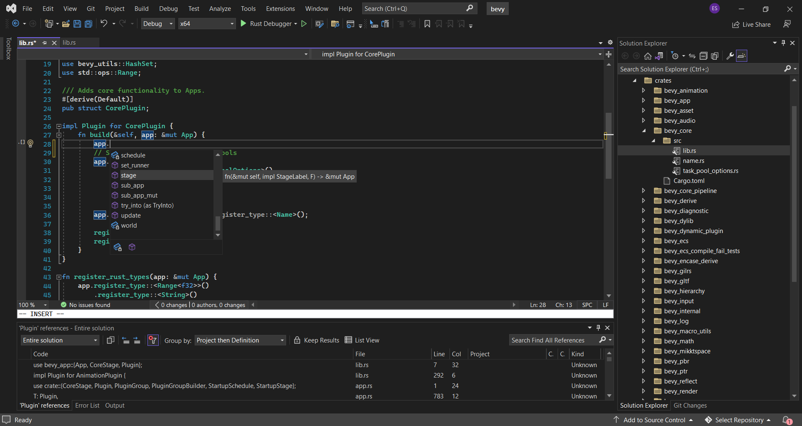

# SourceGear Rust

This GitHub repo is a place where users of the 
SourceGear Rust Visual Studio extension can ask questions, 
log issues, and find information.

- [Getting Started](getting_started.md)
- [Release Notes](release_notes.md)
- [Visual Studio Marketplace](https://marketplace.visualstudio.com/items?itemName=SourceGear.SourceGearRust)

