# Getting Started

This guide is current as of version 1.0.

For a list of highlights about each release, see the [Release Notes](release_notes.md).

## Install the extension

SourceGear Rust is available in the Visual Studio
Marketplace.  It is compatible with Visual Studio 2022
for Windows, including the Community, Professional, or Enterprise editions.  
Other products in the Visual Studio family
(Visual Studio for Mac, Visual Studio Code) are not supported.

The download for SourceGear Rust is a single file with
a name ending in `.vsix`.  This kind of file is the standard format for 
Visual Studio extensions, and such a file is often referred to as "a VSIX", 

One way to install SourceGear Rust is to download the VSIX
from the Visual Studio Marketplace website:

https://marketplace.visualstudio.com/items?itemName=SourceGear.SourceGearRust

Close Visual Studio itself, and then open the VSIX file, which will bring up 
the VSIX Installer.  This will configure the extension for your installation
of Visual Studio.

Another approach is to use the Manage Extensions feature
within Visual Studio.  If you install a VSIX from there, it will be
scheduled for install, and The VSIX Installer will be launched after
you close Visual Studio.

Either way, after the VSIX is installed, the Rust features should
be available the next time you launch Visual Studio.

## Install the Rust development tools

SourceGear Rust needs the usual Rust development tools to be
installed and available in your PATH.  These include the Rust compiler and its package
manager (Cargo) and various other things to support 
development with Rust.

The standard tool for managing a Rust installation
is called `rustup`:

https://rustup.rs/

If you like, you can maintain your Rust installation
using `rustup` on the command line.  

Alternatively,
the SourceGear Rust extension can help with this task.
When SourceGear Rust is activated, it checks to see
if the necessary Rust development tools are available.
If something is missing or out-of-date, an information
bar will be displayed:

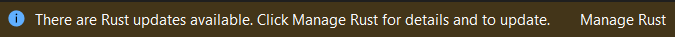

The UI for managing the Rust tools installation looks
like this:

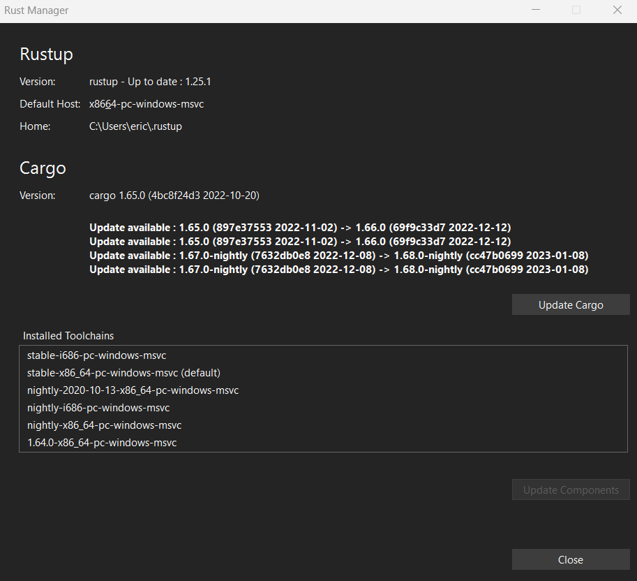

## About Rust projects in Visual Studio

SourceGear Rust is based on Visual Studio's "Open Folder"
mode instead of project files and solutions.  This mode was
added to Visual Studio to support build environments which have
their own build system and therefore do not benefit from MSBuild.
Other examples of extensions which use Open Folder include
CMake, node.js, and Python.

To open a Rust project in Visual Studio, in the dialog box
where Visual Studio asks "What would you like to do?", choose
the "Open a local folder" button.

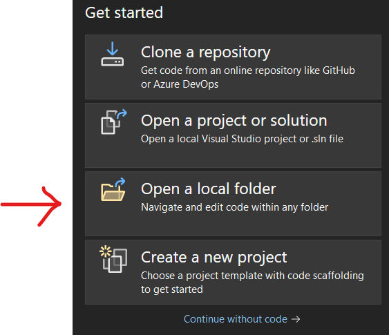

Navigate to the folder containing your Cargo.toml file, and
click the Select Folder button.

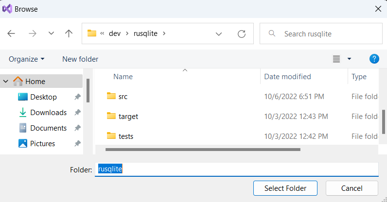

Note that Visual Studio's Open Folder mode can open any folder, 
regardless of
what extensions are present.  The SourceGear Rust extension
recognizes the Cargo.toml and Rust language files and provides Rust-specific features, such as the ability
to build and debug, etc.

## Creating a new Rust project

As a starting point, SourceGear Rust can create a new project
with a template.

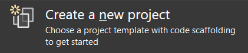

The template(s) can be found by filtering on Rust as
the language:

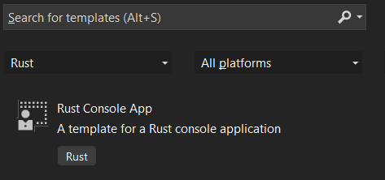

## Intellisense

SourceGear Rust includes support for rust-analyzer to provide
Intellisense-style features.  For example, in the following
screenshot, after typing the dot after `s`, a list of
possibilities is displayed.

Just as with cargo and the Rust compiler itself, the rust-analyzer executable is
installed by `rustup`.  The extension will let you know if it
needs to be installed or updated.

## Rust View

When using Open Folder mode, the Solution Explorer provides
Folder View, which shows the files and folders in the
folder you opened.  Right-click on items to see a context
menu which contain appropriate operations.

SourceGear Rust provides an alternate view which shows
the hierarchy of Cargo packages, targets, and dependencies.
Most of the items
in this view do not correspond to files or folders in the
file system.

To reach this view, there is a button on the Solution Explorer
toolbar which allows you to switch between available views:

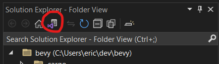

When you click this button, you should see a list of views,
and Rust View should be one of them:

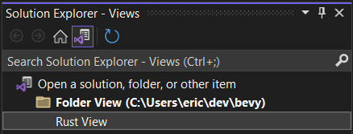

If you choose Rust View, you should now see a hierarchy of
Cargo packages and targets and so on.  

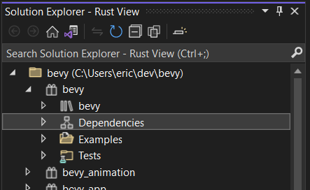

In the screenshot above, the Cargo workspace for the bevy project 
contains a number of
packages.  The top-level package is called `bevy`, and it
contains a library target (also called `bevy`), several
dependencies, some example targets, and some tests.

One thing you can do from Rust View is set which target is
designated for debugging.  Open the Examples folder, right
click on the "3d\_shapes" target, and the context menu should
include the "Set as Startup Project" menu item.  Choosing this
will set the Startup Item in the Visual Studio toolbar accordingly.

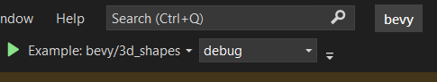

Tapping the launch button to start the debugger should cause
the "3d\_shapes" example to be built and launched.

## Error List

Rust compiler errors are shown in the Visual Studio Error List:

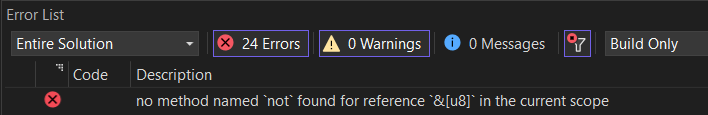

If you double-click on an item in the Error List, the corresponding
source code file will be opened at the location of the error or
warning.

